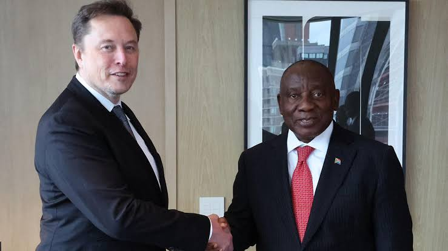
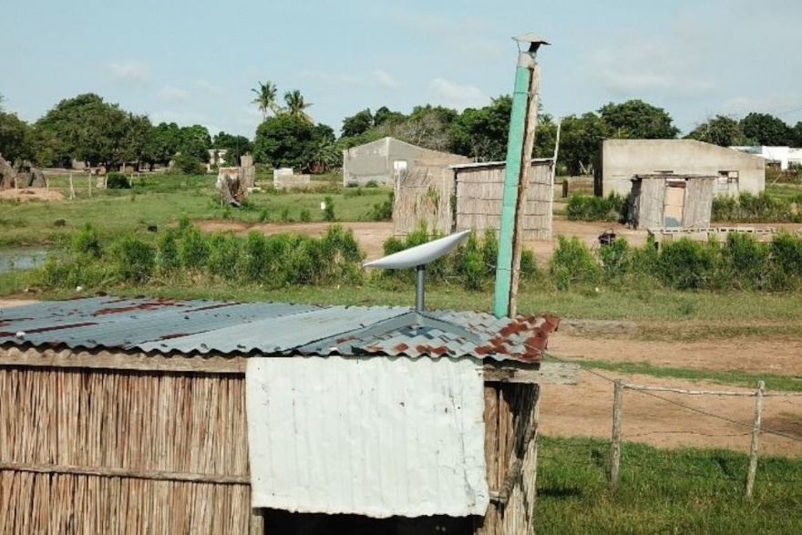
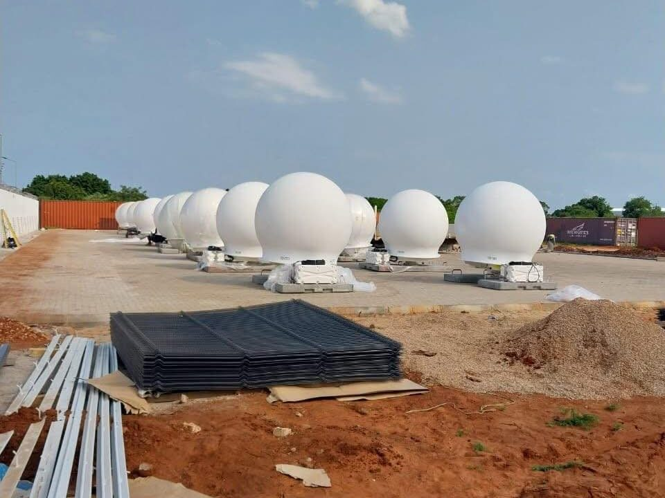

# Satellite Internet Market Entry in South Africa

**A Business Case Analysis of Starlink and Amazon Leo's Regulatory Strategies**

*By Ofentse Ngcongca*

---

## Section 1: Problem Statement

**South African** law requires telecom and satellite companies to be at least 30% owned by historically disadvantaged South Africans before they can get a license to operate (BEE Chamber, 2026; Tech in Africa, 2026). **Starlink** has refused to give up local ownership and has not even applied for a license, so it remains illegal to sell in South Africa (MyBroadband, 2026). **Amazon**, on the other hand, found a way around this by partnering with a South African internet provider, Herotel, and plans to launch in the country in 2027 (Broadband Breakfast/AP, 2026). This project looks at why one company is stuck, and the other found a way in, and what that means for other companies trying to enter the South African market.

  
  

---

## Section 2: Objectives

1. Explain the ownership law that is blocking Starlink from operating in South Africa
2. Compare Starlink's approach (applying directly for a license) with Amazon's approach (partnering with a local company)
3. Look at why Amazon's approach seems to be working while Starlink isn't
4. Recommend the best way for a new satellite company to enter the South African market

---

## Section 3: PESTEL Analysis

### Political

**South Africa's Black Economic Empowerment (BEE)** policy requires telecom license holders to give 30% ownership to historically disadvantaged groups. This is meant to redress apartheid-era economic exclusion, but it has become a major sticking point for Starlink (BEE Chamber, 2026; Tech in Africa, 2026).

The issue has gone well beyond technical regulation and become a genuine diplomatic matter. In May 2025, South African President Cyril Ramaphosa met US President Donald Trump in Washington amid strained relations over land reform policy, HIV/AIDS funding cuts, and refugee claims. South African officials reportedly prepared a workaround to BEE law specifically to ease tensions with Trump and Musk, who is South African-born and a close Trump ally (Cape Argus, 2025; Daily Investor, 2025).

Domestically, the ruling ANC is divided. Some party members support an exception for Starlink to attract investment and expand internet access — about a quarter of South Africans still lack internet access. Others see any exception as undermining Black economic empowerment, especially after Musk publicly called the BEE **law "racist and improper"** (Techzim, 2025). Even South Africa's largest trade union federation, COSATU, has suggested a workaround is worth considering to help ease tensions with the US (IOL/COSATU, 2025).

Communications Minister Solly Malatsi has pushed for Equity Equivalent Investment Programs (EEIPs) as a compromise, but the regulator ICASA rejected this in May 2026, saying the underlying law would need to change first (MyBroadband, 2026). This leaves South Africa in a political deadlock, caught between its constitutional transformation goals, internal party politics, and pressure to maintain good relations with the United States.

### Economics

The economic case for satellite internet in South Africa comes down to a real, measurable connectivity gap. According to Statistics South Africa's General Household Survey, 82.1% of households had some form of internet access in 2024, but only 17.4% had fixed internet access at home (Engineering News/ICASA, 2026). The gap is sharpest in rural provinces: fixed home internet access was just 7.0% in Limpopo and 5.6% in Mpumalanga, compared to 44.9% in the Western Cape (Engineering News/ICASA, 2026). In September 2025, Parliament heard that more than 16,000 South African public schools still lacked internet connectivity for teaching and learning (Daily News/IOL, 2026).

This gap has a direct economic cost. Traditional fibre and mobile tower infrastructure is expensive to build in remote, low-density areas, which is exactly why satellite internet is attractive — it can reach schools, clinics, and households that would otherwise never get a fixed-line connection (Daily News/IOL, 2026). The South African government's own SA Connect programme has set a target of connecting 80% of households to the internet within three years, and Vodacom has already signed an agreement with Starlink to expand satellite broadband into hard-to-reach rural areas elsewhere in Africa (gov.za, 2024; Daily News/IOL, 2026).

The economic tension is this: the longer the BEE ownership dispute delays Starlink's entry, the longer rural households, schools, and clinics go without affordable internet options, which in turn limits economic participation, education outcomes, and healthcare access in the very communities BEE policy is meant to uplift.

### Social

South Africa's digital divide is not just about geography — it is closely tied to race and household income, which links this issue directly back to the BEE debate itself. Research from the **Gauteng City-Region Observatory** found that in many townships and peripheral areas — places with below-average household incomes and predominantly Black African populations — fewer than 40% of households have a home internet connection (GCRO, 2026). This shows that the same historically disadvantaged communities BEE law is designed to uplift are often the ones least connected to the internet.

This gap has real consequences beyond convenience. A lack of internet access restricts education, limits economic opportunity, makes it harder to adapt to changing job markets, and reduces access to healthcare and social services (Polity/The Conversation, 2026). Researchers describe this as a "vicious cycle" — without access, communities cannot participate in the digital economy, which in turn limits their ability to improve their circumstances (GCRO, 2026).

*Starlink dish on a shack in a rural area in Mozambique. Credit: Jan van Gerve*

This creates a genuine social dilemma at the heart of the Starlink debate: BEE ownership law exists to protect and empower historically disadvantaged South Africans, but by keeping Starlink out of the market, **it may also be delaying internet access for the very same communities.** Whether a satellite provider can reach remote and lower-income households often depends less on national politics and more on whether that provider is ever licensed to operate there at all.

### Technological

**Starlink and Amazon LEO** both use low-Earth orbit (LEO) satellites, which orbit much closer to Earth than traditional satellites, giving them **lower latency and higher speeds** than older satellite internet technology. Starlink typically delivers download speeds of 50–250 Mbps with latency around 20–40 ms when connected to a nearby ground station, compared to legacy satellite services which often had latency in the hundreds of milliseconds (IOL, 2025; BEE Chamber, 2025).

A key technical requirement for this to work well is a local ground station, also called a Point of Presence (PoP) — a physical facility that connects the satellite network to the actual internet. Without a nearby ground station, data must bounce between satellites over much longer distances, which increases latency significantly; some Sub-Saharan African countries relying on distant ground stations recorded latency in the hundreds of milliseconds (BEE Chamber, 2025). Notably, Starlink has already built a ground station in Johannesburg, South Africa — meaning SpaceX has already invested in local technical infrastructure, even though it still isn't legally licensed to sell the service in the country (Tech Africa/Ookla, 2026). By comparison, when Starlink used to rely on a single ground station in Nigeria, South African users (mostly on illegal roaming subscriptions) saw latency of 200–300 ms; this dropped sharply once nearby ground stations came online in Kenya and elsewhere in the region (BEE Chamber, 2025).

*Starlink ground station under construction in Mozambique. Credit: Stellar Systems*

This creates an unusual technological picture: the physical and technical groundwork for a fast, reliable Starlink service in South Africa is largely already in place. The barrier to South Africans using it is not technology — it is **regulation**.

### Environmental

Environmental factors are a smaller part of this business case, but still worth noting. Large satellite constellations like Starlink and Amazon LEO have drawn criticism from global astronomy bodies, including the American Astronomical Society and the International Astronomical Union, over light pollution and interference with both optical and radio astronomy observations (Astronomy.com, 2019; Discover Magazine, 2019). This is particularly relevant to South Africa, which hosts major radio astronomy infrastructure, including the Square Kilometer Array (SKA) and MeerKAT telescope — projects that rely on extremely sensitive, interference-free radio observation.

There are also broader concerns about orbital space debris and the long-term sustainability of low-Earth orbit as thousands of satellites are launched by multiple companies (Scientific American, 2023; Fox35, 2023). While these are global issues rather than South Africa-specific ones, any regulatory approval process for a new satellite entrant would likely need to at least acknowledge radio-frequency interference risk to existing South African astronomy assets.

### Legal

Beyond the political debate, there is a very specific legal process a satellite operator must follow to operate in South Africa. ICASA confirmed in a June 2026 government gazette that any satellite constellation operator needs three separate licenses: **an Individual Electronic Communications Service (I-ECS) license**, **an Individual Electronic Communications Network Service (I-ECNS) license**, and one or **more Radio Frequency Spectrum (RFS) licenses** (ICASA Government Gazette, 2026; Space in Africa, 2026).

Getting an I-ECNS license is not simply a matter of applying — the Electronic Communications Act says ICASA can only accept these applications once the Minister of Communications issues a formal "policy direction," and ICASA must then publish an "Invitation to Apply" before anyone can apply at all (ICASA Government Gazette, 2026). As of mid-2026, no such invitation exists — instead, the Department of Communications instructed ICASA to first hold an inquiry into whether new I-ECNS licenses are even needed, and that inquiry is still ongoing (TechCentral, 2026).

This means that, legally, there are currently only two realistic paths into the South African satellite market: **(1) wait for the government to open a formal application process**, which could take years, **or (2) negotiate directly with an existing license holder to buy or transfer their license**, a process described as "complex and very time-consuming" (Mondaq, 2026). This is legally separate from, but layered on top of, the 30% historically-disadvantaged-ownership requirement discussed earlier.

---

## Section 4: Competitor Analysis

| **Factor** | **Starlink** | **Evry (Amazon Leo / Herotel)** | **Local Fibre (Openserve, Vumatel)** | **Mobile (MTN, Vodacom)** |
|---|---|---|---|---|
| **Regulatory status in SA** | Not licensed; no application submitted after 6+ years | Legally structured to launch 2027, no new license needed | Fully licensed, established | Fully licensed, established |
| **Compliance approach** | Direct license application, refuses to transfer equity | Partners with already-licensed Herotel, Amazon holds no SA license or equity | N/A (already compliant) | N/A (already compliant) |
| **Speed** | 50–250 Mbps | Up to 300 Mbps (400 Mbps on Pro antenna) | Up to several Gbps (network-dependent) | Varies; 5G up to ~2 Gbps in optimal conditions |
| **Latency** | ~20–40 ms (with nearby ground station) | ~50 ms or less | Lowest, typically single digit to low double-digit ms | ~27 ms average, lower on 5G |
| **Target market** | Currently unavailable in SA (grey market use only) | Farms, small towns, townships, rural areas beyond fibre's reach | Urban and metro areas with existing infrastructure | Broadest reach nationally, especially mobile data |
| **Pricing Model** | Unknown | Expected to match Herotel's existing fibre prices, held stable ~3 years | Ranges from R99/month (prepaid township fibre) to R2,400+/month (gigabit) | Fibre-comparable bundles; data-based mobile pricing |
| **Launch timeline** | Unknown | 2027 | Already operating | Already operating |

*(Sources: FastestFibre, 2026; IOL, 2025; State of Fibre Internet in South Africa 2026 report)*

**Key competitive insight:** Starlink and evry use nearly identical underlying satellite technology and target a similar underserved market, but they are not really competing on product — they are on two completely different regulatory tracks. Evry avoided South Africa's ownership law entirely by partnering with an already-licensed local operator (Herotel), while Starlink has spent over six years trying to obtain its own license directly and remains the only SADC country where the service isn't live. This means **evry**, not fibre or mobile, is Starlink's real competitive threat in South Africa, and it may launch and capture the rural/underserved market before Starlink is ever legally available at all.

---

## Section 5: Stakeholder Analysis

| **Stakeholder** | **Interest/Position** | **Influence** |
|---|---|---|
| **ICASA** | Enforcing the Electronic Communications Act; has firmly refused to bypass the 30% ownership rule without a change in law | High — controls all licensing decisions |
| **Minister of Communications (Solly Malatsi)** | Wants to attract investment and expand connectivity; proposed EEIPs as a compromise, but was overruled by ICASA | Medium — cannot override ICASA or the Act itself |
| **Parliament** | Would need to amend the Electronic Communications Act for EEIPs to become a legal option | High, but slow |
| **Starlink / SpaceX (Elon Musk)** | Wants a license without giving up equity; has called the ownership law "racially discriminatory" | Medium — global scale and political connections, but limited local leverage |
| **Herotel / Maziv (owns Vumatel)** | Found a compliant workaround by distributing Amazon's satellite service (evry) through its own existing licenses | High — already has the licenses, infrastructure, and local operational experience needed |
| **Amazon / Amazon Leo** | Wants South African market access without taking on equity or licensing risk; structured a wholesale partnership instead | Medium-High — large capital investment, but relies entirely on Herotel's compliance status |
| **Rural communities, schools, clinics** | Want affordable, reliable internet access regardless of which company provides it | Low direct influence |
| **COSATU (trade union federation)** | Has suggested a workaround to BEE law is worth considering to help ease tensions with the US and unlock investment | Medium — represents organized labour's political voice, but not a regulatory decision-maker |
| **ANC (ruling party)** | Internally divided — some support exceptions to attract investment, others see any exception as undermining Black economic empowerment | High — controls government policy direction |
| **Existing local ISPs and mobile operators (MTN, Vodacom, other fibre networks)** | Generally not threatened in urban/suburban markets, but competing for the same rural/underserved segment satellite is targeting | Medium — established market position, but limited reach into deep rural areas |
| **US Government / diplomatic relations** | Starlink's SA entry has become tied to broader US–South Africa diplomatic tension (land reform, tariffs, Musk's political ties) | Medium-High — external pressure that has already shaped policy discussions (e.g. the 2025 Ramaphosa–Trump meeting) |

**Key stakeholder insight:** The most important dynamic here is that ICASA and Parliament are the only stakeholders who can change the legal outcome, and neither has shown willingness to move quickly.

---

## Section 6: Regulatory Compliance Strategy

Based on everything covered so far, there are three realistic paths a new satellite internet entrant could take to operate legally in South Africa today — plus one path that exists on paper but isn't currently usable.

**Path 1: Apply directly for a new license**

This is what Starlink has effectively tried (or failed to try) for over six years. ICASA confirmed in June 2026 that it cannot even open a new licensing window for satellite operators, because the legal precondition — a ministerial policy direction plus a published "Invitation to Apply" — does not exist yet (TechCentral, 2026; Advanced Television, 2026).

- *Pros:* Full control; no reliance on a local partner.
- *Cons:* Not currently possible under law. No timeline for when (or if) this route opens.
- *Verdict:* Not viable in the short-to-medium term.

**Path 2: Acquire or transfer an existing license from a current holder**

ICASA has confirmed this is the one route that works right now — a new entrant can buy or take over the license of a company that already holds one (TechCentral, 2026). This is legally distinct from applying fresh, since the license itself already satisfies the 30% ownership requirement.

- *Pros:* Legally available immediately; regulator has explicitly confirmed it as valid.
- *Cons:* Described by legal analysts as "complex and very time-consuming" (Mondaq, 2026); requires finding a willing license holder and negotiating a sale, which is a significant commercial undertaking.
- *Verdict:* Viable, but slow and uncertain in practice.

**Path 3: Wholesale distribution partnership with an already-licensed local operator**

This is the model Amazon Leo used to launch evry through Herotel. The foreign company supplies satellites and technology as a wholesale partner, while the already-licensed local operator holds all the regulatory responsibility, equity, and customer relationships (FastestFibre, 2026).

- *Pros:* Fastest realistic path to market; avoids the ownership dispute entirely rather than trying to resolve it; leverages an established local operator's infrastructure and customer service.
- *Cons:* Foreign company gives up direct control of the customer relationship and brand-in-market; success depends entirely on finding the right local partner.
- *Verdict:* Proven to work — this is the only path that currently has a confirmed 2027 launch date.

**Path 4 (not yet usable): Equity Equivalent Investment Programme (EEIP)**

Starlink has proposed satisfying BEE requirements through structured local investment instead of giving up equity. Minister Malatsi issued a policy direction supporting this in December 2025, but ICASA has said it cannot implement EEIPs without an amendment to the Electronic Communications Act itself (MyBroadband, 2026; FastestFibre, 2026).

- *Verdict:* Legally blocked for now; could become viable if Parliament amends the Act, but there is no timeline for this.

**Recommendation:** For a new LEO satellite entrant weighing these options today, Path 3 (wholesale partnership with an existing licensed operator) is the clear evidence-based recommendation. It is the only path with a proven, working precedent and a confirmed launch timeline, while Paths 1 and 4 are currently legally blocked and Path 2 carries significant time and complexity risk.

---

## Section 7: Recommendation / Conclusion

Starlink has spent over six years trying to obtain its own network licence directly, refusing to transfer local equity, and South Africa remains the only SADC country without a live Starlink service. Amazon Leo avoided this entirely by partnering with an already-licensed operator, Herotel, to launch as evry, securing a confirmed 2027 launch with no equity transfer or legal change required.

**Recommendation:** A new satellite entrant should partner with an existing licensed South African operator rather than pursue a direct licence application. This route is faster, avoids the ownership dispute entirely, and has a proven precedent.

More broadly, this case shows a real tension in South African policy: strict BEE ownership rules can delay the same connectivity benefits they're meant to help deliver. A properly implemented EEIP framework could resolve this, but remains legally unresolved as of 2026.

---

## Section 8: References

1. BEE Chamber. (2026, April 22). *New rules for satellite internet operators in South Africa — including Starlink.* https://www.bee.co.za/post/new-rules-for-satellite-internet-operators-in-south-africa-including-starlink
2. MyBroadband. (2026, June 16). *Why Starlink has not applied for a licence in South Africa.* https://mybroadband.co.za/news/broadband/654094-why-starlink-has-not-applied-for-a-licence-in-south-africa.html
3. MyBroadband. (2026, May 13). *Bad news about Starlink in South Africa.* https://mybroadband.co.za/news/telecoms/647306-bad-news-about-starlink-in-south-africa-2.html
4. Tech In Africa. (2026, January 29). *Is Starlink legal in South Africa? Full ICASA rules, licensing, and what changes in 2026.* https://www.techinafrica.com/is-starlink-legal-south-africa-icasa-rules-licensing-2026/
5. ITWeb. (2026, June 15). *No Starlink licence application in SA yet.* https://www.itweb.co.za/article/no-starlink-licence-application-in-sa-yet/5yONPvErdlP7XWrb
6. FastestFibre. (2026, July 16). *Amazon just solved the problem that kept Starlink out of South Africa.* https://fastestfibre.co.za/news/amazon-leo-satellite-broadband-herotel-2026/
7. FastestFibre. (2026, July 28). *ICASA just told Starlink exactly how to get a licence.* https://fastestfibre.co.za/news/starlink-icasa-license-workaround-2026/
8. TechCentral. (2026, June 29). *ICASA's blunt message to Starlink and other satellite operators.* https://techcentral.co.za/icasas-blunt-message-to-starlink-and-other-satellite-operators/283138/
9. Advanced Television. (2026, June 30). *ICASA sets out demands for Starlink in South Africa.* https://www.advanced-television.com/2026/06/30/icasa-sets-out-demands-for-starlink-in-south-africa/
10. Engineering News / ICASA. (2026). *State of the ICT sector report.*
11. Daily News / IOL. (2026). *Parliament briefing on school connectivity.*
12. Gauteng City-Region Observatory (GCRO). (2026). *Digital divide research.*
13. IOL. (2025). *Starlink satellite technology overview.*
14. Astronomy.com / Discover Magazine. (2019). *Satellite constellation impact on astronomy.*

---

**Acknowledgement of AI Use:** Claude (Anthropic) was used to assist with research synthesis, structuring, and drafting of this business case. All factual claims were sourced from the references listed above.
